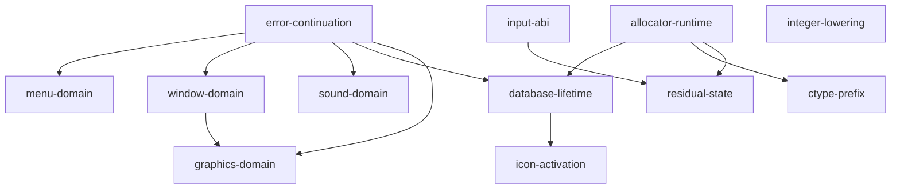

# Current reconstruction status

Generated by `python tools/repository.py --write-status`. Membership comes from
`src/program.json`; import grounding comes from `evidence/canonical/blockers.json`;
native exceptions come from `portable/platform.json`. This page is a view, not
another inventory. Validation results and cleanup metrics are in [cleanup.md](cleanup.md).

The shared program has 199 whole source TUs and 29 strict semantic registrations.
Independent DOS linking remains blocked by 1 storage imports, 4 semantic gates and 44 functional bytes in 6 ranges. No standalone DOS game or human acceptance is established.

Manual SDL3 playtesting found broken sound, a logo-click hang and a discrepancy
in the intended 640x480 VGA path. [Playtest report](../evidence/canonical/validation/manual-playtest.json).
Standalone reconstructed DOS closure takes priority over native symptom fixes.
Bounded native passing flows do not close the exceptions below.
`functional-source-oracle-v1` is pending.

## Closure classes and root questions

`SOURCE_REQUIRED` needs an executable source contract. `SUPPORTED_DOMAIN` needs
a complete bound on supported callers/resources. `LAYOUT_SENSITIVE` has a real
conditional adjacency but unresolved ordinary observability. `UNATTRIBUTED_STATE`
needs ownership or exclusion, not necessarily a semantic field name.
These classes organize proof; all open entries still block canonical preflight.
Historical-only facts are listed separately. See [closure strategy](dos-closure.md).

Edges below point from prerequisite evidence to the dependent root question.

| Root question | Affected entries | Proven premises and next experiment |
| --- | --- | --- |
| `error-continuation`: Which Punt paths return, and which callers can reach them? | gates: `graphics-computed-copy-layout` | Punt returns immediately for nonzero guard. Original DosPunt returns for guard1, including two nested calls at errno24. Exhausted OpenDB actually reaches record[-1] under that incoming state. Sound and critical-selector aliases are excluded by complete supported producer domains. Original returning-Punt counterexamples and other layout-sensitive gates remain. Next: Trace guard transitions in original DOSBox-X startup/failure paths; retain isolated original-instruction returning controls. |
| `menu-domain`: What complete title and event-ID domains reach menu arrays? | imports: ; gates: ; native:  | Canonical five-word x/width owners cover all shipped title writers and nominal keyboard/mouse event readers; process-long storage/menu resource lifetime is proved. Historical capacity and replacement/corrupt inputs are unclaimed. Next: Resolved in the published supported domain; preserve census, original-instruction controls and native array ownership regression. |
| `window-domain`: Which IDs, palette rows and purge lengths can shipped windows select? | imports: ; gates: ; native: `native-window-optional-words`, `native-window-object-domain` | All34 window resources enumerated; palette copy96bytes and preload/purge indices0..33 bounded. Selected palette63 is excluded in the reviewed nominal valid-object/save domain; A003 versus A803 original-event controls distinguish the auto-selection gate. Original FileSelect and successful AH47 directory wrapper select C: object13 versus K: object21; actual shipped window22 contains21 objects. The latter triggers the original bounds diagnostic. Returning-Punt continuation is a separate explicit control. Canonical sixteen-row palette owner covers the 96-byte resource copy and reviewed palette consumers; invalid object paths remain an independent gate. Reviewed stack lifetime limits simultaneous open windows to31; original mutations and implicit AX0 forwarding have permanent controls. Application proxy arithmetic is bounded separately from object validity. Canonical 34-cell near Handle owner: complete caller, event/resource, stack and ordinary saved-state ID roots; CRT zero initialization; non-escaping table and source allocator lifetime. Guard 34 read-before-Punt, fabricated descriptors and YardMode5 remain negative controls. The admitted complete high-byte domain 0..33, 34-cell Handle owner, sixteen-row palette and 45-entry hook/Rect arrays cover the specified array accesses, reset and copy lengths. Original hook indices -1/45 and K: low-object21 counterexamples remain. General object, optional-word, heap and graphics-copy effects remain independently unresolved. Next: Preserve independent palette/handle ownership and complete the remaining invalid object, proxy/graphics and optional-window-word effects. Do not waive K: object21 or foreign-state counterexamples. |
| `sound-domain`: What sample and track counts and device selectors reach live storage? | imports: ; gates:  | The complete shipped corpus has 2..10 tracks; all status/time accesses and aliases are bounded and initialized before enabled ISR use. Canonical source owns the supported 10-slot footprint. Locked Sound Mode 6 and the complete startup/writer/save audit bound setup selection to 1 or 6 and pre-setup cleanup to CRT-zero selector 0. All three nine-entry tables are valid for these indices. Original /s9 indirect-call and returning-failure counterexamples remain outside this existing domain. The complete window ID domain 0..33 excludes cache[-10]; the complete shipped song domain 2..10 excludes the first wrapped selector word store at track index32633. The source/alias and save audits bind these premises. Only those two known alias contracts are discharged; other physical writes remain under the open graphics-copy and viewport gates. The mutable owner and reader remain unchanged; no deadness, global preservation or arbitrary-state equivalence is claimed. A 39-entry far-pointer owner covers every successful f_0000_0149 store through the first free-list fatal boundary. Original indices 0/38, rejected 39, returning-Punt index39, complete source census and all shipped song streams are retained controls. No original producer TU, placement or exceptional continuation is claimed. Next: Sample free-list ownership is closed in the successful domain. Continue independent native audio-host and exceptional-continuation work. |
| `database-lifetime`: Can successful resource/save/load paths exhaust four DB slots or exceed the filename selector's local path capacity? | imports: ; gates: `filename-selector-local-capacity`; native: `native-index-adjacency`, `native-drive-device-policy` | Exactly three acquisitions per successful pinned default VGA main lifetime; no release/reentry or save-table write changes slots/counter. Both adjacency gates are excluded in this domain; returning Punt failure controls remain. The 100-byte global last-filename object is source-owned for all defined successful copies. This does not exclude the earlier FileSelect path[67] overflow demonstrated by the 69-byte path contrast. Next: Prove the selector filesystem/current-directory domain; independently investigate FindIndex/cache/heap behavior and excluded failure or external-resource configurations. |
| `graphics-domain`: Which viewport, clip, spider and mono footprints occur in supported display modes? | imports: `_fd_50F6_3C14`; gates: `graphics-computed-copy-layout`, `map-viewport-grid-layout`; native: `native-font-output-domain`, `native-clip-allocation-policy` | Separate original and provisional source DOSBox-X traces both observe mode12h and VGA640x480; this is mode entry, not rendering/input/gameplay equivalence. Original synthetic 31-window clipping control writes beyond the 256-record temporary before Punt; the 29-window positive completes. Window count alone does not prove capacity. Shipped geometry reachability remains unproved. The VGA8/HCEGANT spider image has one 6,276-byte zero-initialized process-lifetime owner. Resource, raster, overlap, first-use zero-header and valid source-produced index domains bound all supported accesses; alternate display resources remain excluded. Locked configuration and the complete startup/writer/alias/save census preserve mode8. Startup skips LoadMonoPats, map dispatch selects S00 color converters and Mini_MakeTable bypasses every S01 pattern consumer. A one-byte near linkage owner supplies the unresolved symbol with zero supported accesses; odd-mode reads remain negative controls and historical capacity is unclaimed. Next: Resolve complete clip geometry/copy ownership and viewport resize/input bounds; odd display modes still require independent monochrome resources and allocation evidence. |
| `icon-activation`: Can supported display mode reach either icon-slot load? | gates: ; native:  | Locked configuration sets mode 8; complete startup/writer/alias/save census preserves it. Both icon helpers bypass the slot load for every selector and slot value, independently of activation. Next: Resolved for mode 8; preserve startup/state/save census and original mode-2 pointer-load contrasts. Other display modes require independent evidence. |
| `allocator-runtime`: Which source/runtime owners and heap histories does the real link select? | native: `native-heap-history`; gates:  | RTLink NOEXTDICTIONARY resolves CRT/canonical _ffree collision with unchanged objects and libraries; all warnings remain fatal. Positive and duplicate-producing negative controls pin canonical call binding. The captured S06 has 119 distinct sites at twice the load base while every other byte matches disk. Original direct display callbacks were instead vectored by the diagnostic link; timer cursor callbacks can re-enter the non-reentrant loader. Explicit symbolic vector selection restores direct dispatch and required canonical/alias loading calls, with real-link positive and negative controls. All admitted ordinary storage owners except the clip rectangle destination now compile directly into the native projection. The remaining pointer, capacity, lifetime and allocation-failure differences are owned solely by native-clip-allocation-policy. Next: Exercise longer original/source gameplay and Save/Load under the corrected explicit vector policy; compare heap and failed-index histories. Keep the original unsnapshotted failures distinct from the proven callback-binding defect. |
| `ctype-prefix`: Do supported text inputs observe the CRT prefix and changing far-heap pointers? | gates: `ctype-out-of-range-index-layout`; data: `dgroup_79f0` | Census actual styled text and runtime keyboard domains; trace prefix reads/writes and perturb CRT code/data placement. |
| `input-abi`: Which event words and input records are actually observed? | data: `dgroup_60b0`, `dgroup_5a28`; native: `native-event-omitted-word`; gates:  | Trace queue producers/consumers and interleavings; distinguish preserved opaque descriptor shape from activation. |
| `residual-state`: Which unattributed bytes need preserved state, an opaque owner, or startup erasure? | data: `dgroup_56fe`, `dgroup_5a96`, `common_tail_overlap_3`; gates:  | Derive neighboring contribution/relocation and startup-write evidence; admit bounded opaque typed state only with an independent owner bridge. |
| `integer-lowering`: Which DOS integer expressions still differ under host promotion rules? | native: `native-integer-expressions`; gates:  | Extend mechanical width conversion only with a source-grounded expression domain and negative controls. |

### Source storage imports

| Symbol | Class | Required resolution |
| --- | --- | --- |
| `_fd_50F6_3C14` | SOURCE_REQUIRED | f_1E57_0174 (root:1E57 clip unit): far address 50F6:3C14 temporary clip rect buffer (memcpy target, stored into g_5AAC). Original synthetic 31-window control generates 256 rectangles and overruns the separate 2048-byte heap temporary before Punt. Neither the stack bound nor that temporary proves this destination's complete supported extent. |

### DOS address and ownership gates

| ID | Class | Reason |
| --- | --- | --- |
| `ctype-out-of-range-index-layout` | LAYOUT_SENSITIVE | Styled text and menu item classification sign-extend character bytes before indexing the near CRT table. Bytes D1..DE can read original DGROUP:79F0..79FD through _ctype+1 without any literal 79F0 operand. The stock runtime table owns its 257 bytes, not the preceding memory. The styled-text predicate can change the copied buffer and its text-resource match. Other dialog/menu sites also read outside the table; result relevance is assessed separately. No source guard or accepted input-domain proof excludes these prefix reads, and independent linkage does not preserve the original prefix. Keep the heap-shaped data debt; do not substitute unsigned indexing or add an invented table prefix/suffix. Whole-member controls on both linkers realize __fheap at _ctype-46, but identical data order still leaves six relocated CMISC pointers in the signed prefix: moving only crt0fp code changes twelve predicate results. Independent stock-runtime fixtures mutate far-heap pointers; this is not proven original behavior. Two bounded original CRT-to-main no-EMS traces leave 79F0..79FD unchanged while observing the actual game allocator 171C:2208 and positive writes to near-heap 7706 and __amblksiz 79FE. The latter owns 79FE..79FF, not alignment fill. Later-game and other-environment equivalence remain unproved. App heap-state equivalence remains unproved, so relative owner attribution alone discharges no bytes. |
| `graphics-computed-copy-layout` | SUPPORTED_DOMAIN | The clip sentinel/generation count controls a copy to FAR_BSS 50F6:3C14. Large counts can intersect the historical graphics table addresses. Initial-state recipes do not prove those counts unreachable or preserve such physical overlap under an independent layout. Punt return and sentinel-copy bounds remain unresolved. Original synthetic 31-window geometry generates 256 disjoint rectangles; the 2048-byte heap temporary receives its sentinel at displacement 2050 before the C097 diagnostic. The adjacent 29-window control completes with 225 rectangles. This rejects the window-count capacity premise without proving shipped-state reachability or the fixed destination extent. |
| `map-viewport-grid-layout` | SUPPORTED_DOMAIN | ZapEuMapAt and InvalEuMap bound writes against runtime viewport dimensions, rather than the thirty-row/forty-column storage extent. Dimensions derive from object 4 rectangles; resize and loaded window offsets are not yet proved to enforce that grid bound. A baseline resource rectangle in range does not prove all reachable writes or preserve cross-object overreads under a new layout. |
| `filename-selector-local-capacity` | SUPPORTED_DOMAIN | FileSelect uses path[67] and lastDir[67]. A real DOSBox-X contrast reaches a valid deep path needing 69 bytes after separator append, before the result is copied into the 100-byte last-filename owner. The admitted owner therefore closes the global storage import but does not repair or exclude this earlier local overflow. |

### Resolved within the supported execution domain

`shipped-default-vga-successful-lifetime`:

* One ordinary main lifetime with pinned default VGA configuration and resources.
* Successful resource file/header/index/allocation operations and valid nominal game/save state.
* No external language/lrshare package, display override, alternate setup, /s9 or replacement resources.

This is the common domain of admitted functional owners and resolved adjacency contracts; it does not establish whole-game acceptance or correctness on excluded failures/inputs.

| Contract | Reviewed resolution |
| --- | --- |
| `menu-table-cross-owner-layout` | [Supported-domain accesses exclude the recorded historical adjacency; original algorithms and out-of-domain counterexamples remain unchanged.](../evidence/canonical/menu-title-owner/review.md) |
| `database-open-minus-one-record` | [Supported-domain accesses exclude the recorded historical adjacency; original algorithms and out-of-domain counterexamples remain unchanged.](../evidence/canonical/database-domain/review.md) |
| `database-handle-plus-four` | [Supported-domain accesses exclude the recorded historical adjacency; original algorithms and out-of-domain counterexamples remain unchanged.](../evidence/canonical/database-domain/review.md) |
| `icon-handle-computed-alias-and-activation` | [Locked configuration and complete startup/state/save census preserve mode 8. Both helpers bypass the icon-slot pointer loads for every selector and slot value, even if activated. Original mode-2 counterexamples and canonical slot ownership remain; no other-mode payload, renderer or whole-game acceptance.](../evidence/canonical/icon-handle-view/vga-review.md) |
| `icon-handle-cell-and-payload-lifetime` | [Locked configuration and complete startup/state/save census preserve mode 8. Both helpers bypass the icon-slot pointer loads for every selector and slot value, even if activated. Original mode-2 counterexamples and canonical slot ownership remain; no other-mode payload, renderer or whole-game acceptance.](../evidence/canonical/icon-handle-view/vga-review.md) |
| `sound-selector-out-of-range-layout` | [Locked Sound Mode 6 and the complete startup/writer/save audit bound setup selection to 1 or 6 and pre-setup cleanup to CRT-zero selector 0. All three nine-entry tables are valid for these indices. Original /s9 indirect-call and returning-failure counterexamples remain outside this existing domain.](../evidence/canonical/audio-track-owner/selector-review.md) |
| `window-index-resource-cross-owner-layout` | [The admitted complete high-byte domain 0..33, 34-cell Handle owner, sixteen-row palette and 45-entry hook/Rect arrays cover the specified array accesses, reset and copy lengths. Original hook indices -1/45 and K: low-object21 counterexamples remain. General object, optional-word, heap and graphics-copy effects remain independently unresolved.](../evidence/canonical/window-domain/array-gate-review.md) |
| `critical-selector-computed-alias-layout` | [The complete window ID domain 0..33 excludes cache[-10]; the complete shipped song domain 2..10 excludes the first wrapped selector word store at track index32633. The source/alias and save audits bind these premises. Only those two known alias contracts are discharged; other physical writes remain under the open graphics-copy and viewport gates. The mutable owner and reader remain unchanged; no deadness, global preservation or arbitrary-state equivalence is claimed.](../evidence/canonical/error-continuation/selector-review.md) |

### Unowned functional data

| ID | Class | Bytes | Reason |
| --- | --- | ---: | --- |
| `dgroup_56fe` | UNATTRIBUTED_STATE | 4 | Four zero bytes lie before g_5702; no typed field or use chain identifies them. Zero content is not evidence of padding or irrelevance. |
| `dgroup_5a28` | UNATTRIBUTED_STATE | 2 | Two leading zero bytes begin a root:1F58 state range followed by identified keyboard/interrupt fields; no read/write is identified for this word. |
| `dgroup_5a96` | UNATTRIBUTED_STATE | 5 | A 26-byte portion of a shared 1,360-byte UI region includes named/used fields (display selector, far pointer, saved cursor pointers) and other incompletely typed bytes. |
| `dgroup_60b0` | UNATTRIBUTED_STATE | 18 | 18-byte record uses the registered hot-box ABI shape: rectangle, callback, event code, extra event word and input mask. Its callback relocation is real, but the bounded scan supplies no inbound registration or allocation owner. Timer spelling is not a timing contract; computed or unowned access remains unexcluded. |
| `dgroup_79f0` | UNATTRIBUTED_STATE | 14 | The unique pinned fdata.asm initialized-member candidate overlaps signed (_ctype+1)[char] prefix reads D1..DE at 79F0..79FD, but original symbolic selection/placement is unadmitted. Six relocated CMISC pointers change prefix predicates under moved linkage. Two modeled original no-EMS CRT-to-main traces leave the candidate unchanged; independently linked stock far-heap mutation is not original lifetime proof. Later aliases, input domains and app heap-state equivalence remain unproved. |
| `common_tail_overlap_3` | UNATTRIBUTED_STATE | 1 | One residual boundary byte has no accepted erasure/irrelevance proof. Two other prior file values were erased in the reviewed ordinary manager/CRT/DOS control; actual linked-game startup clear dominance remains required. |

### Native exceptions

| ID | Scope |
| --- | --- |
| `native-heap-history` | The discarded size/resize discrepancy is repaired: original and current native public APIs report size zero after discard and restore a 100-byte firm allocation into the same handle while leaving another handle discarded. See evidence/canonical/allocator-fixtures/. Full native/DOS heap-history equivalence remains unproved: discarded name/age/attributes retain per-slot metadata instead of the shared DOS template; paragraph copying, flags/counters, 16-bit limits, physical/EMS layout and failure policy remain outside this bounded repair. Canonical algorithms are unchanged. |
| `native-index-adjacency` | FindIndex native one-past guard returns null before canonical index[count] predicate. Real song lookup10010 can miss past HCEGANT271 rows before SOUND succeeds. Original SOUND allocation followed by original Ralloc320 makes a neighboring Block header match synthetic ID0/kind22 and return as an index row; allocation304/free controls and known mono IDs10000/10010 return null. Natural game false-hit reachability and native/DOS heap-history equivalence remain unproved. Native preview semantic exception; bounded observable difference confirmed in evidence/canonical/native-findindex-boundary/. |
| `native-font-output-domain` | Font bitmap native group is source-owned1280 bytes; larger output remains unsupported without source storage proof. |
| `native-window-optional-words` | Omitted DOS argument slots are native zero normalizations. win_Swap stores four caller stack-residue words in DOS; native stores zero, so raw state differs. Current callsites, 34 shipped window resources and the reviewed source observer closure do not observe those differing fields. Custom resource/caller domains remain unsupported; no mechanical raw-state equivalence claim. |
| `native-window-object-domain` | Valid registry-backed object views preserve the source layout relationship. Invalid NULL views remain faultable because callers dereference the returned pointer. Native OOM guard policy and zoom savedRect behavior remain unresolved outside the reviewed valid shipped-resource domain. |
| `native-integer-expressions` | Declared storage/parameter/cast widths and closed explicitly typed unsigned-word additive/comparison expressions are converted mechanically. Declaration-driven intermediate wrap, products/division, shifts, macro expressions and general unsuffixed literal typing still need lowering/domain proof because native integer promotions differ from DOS16bit rules. The bounded closed-expression proof does not establish global expression equivalence. See evidence/canonical/native-word-expressions/ and evidence/canonical/native-integer-promotions/. |
| `native-event-omitted-word` | Four-word DOS enqueue calls inherit an unprovided fifth Event.v word; native supplies zero. Original-instruction controls prove differing queued v under caller-stack contrast, while explicit fifth-zero controls remain equal. Coordinate observers exist; full interleaving/observer closure remains required. See evidence/canonical/event-omitted-word/. |
| `native-clip-allocation-policy` | The unresolved fixed clip storage is represented by a host pointer and dynamic reservation. Its owner, extent and lifetime remain unproved, and the reservation introduces native allocation and failure paths. This one contract supersedes the broader native-storage-ownership contract now that all other formerly duplicated ordinary storage comes directly from canonical owners. |
| `native-drive-device-policy` | Native removes physical BIOS one-floppy B-to-A remapping and uses host drive resolution. Current Windows drive tests validate path services, but no DOS/native physical device-domain comparison or complete caller policy has been accepted. |

Each temporary lowering module has named blocker IDs and a deletion condition
in `layout/repository.json`. The architecture guard rejects absent/closed IDs
while their temporary converters remain. Classification is not a semantic waiver.

## HISTORICAL-BINARY-ONLY

Reviewed declaration/codegen residue, original segment/communal ordering,
RTLink placement/relocation ordering and alignment remain historical build facts.
They do not block the native build. [Generated progress](progress.md) tracks
historical byte debt separately from the functional ranges above.

Only independently admitted facts may close a semantic gate. The existing
hot-box, mono-tail, viewport, index-adjacency and heap investigations grant
no guessed owner, initializer, extent or whole-game equivalence.
