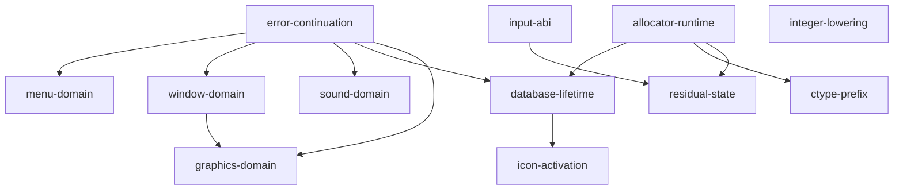

# Current reconstruction status

Generated by `python tools/repository.py --write-status`. Membership comes from
`src/program.json`; import grounding comes from `evidence/canonical/blockers.json`;
native exceptions come from `portable/platform.json`. This page is a view, not
another inventory. Validation results and cleanup metrics are in [cleanup.md](cleanup.md).

The shared program has 200 whole source TUs and 29 strict semantic registrations.
The canonical DOS link has no storage imports, semantic gates or unresolved functional data. 30 bytes in 5 ranges remain documented historical layout debt; physical DGROUP layout equivalence is not claimed. The canonical DOS build passed human gameplay acceptance ([playtest](../evidence/canonical/validation/dos-human-playtest.json)); `functional-source-oracle-v1` tags the closed DOS oracle.

Manual SDL3 playtesting found broken sound, a logo-click hang and a discrepancy
in the intended 640x480 VGA path. [Playtest report](../evidence/canonical/validation/manual-playtest.json).
SDL3 correctness is now measured against the closed DOS oracle (Phase 2).
Bounded native passing flows do not close the exceptions below.

## Closure classes and root questions

`SOURCE_REQUIRED` needs an executable source contract. `SUPPORTED_DOMAIN` needs
a complete bound on supported callers/resources. `LAYOUT_SENSITIVE` has a real
conditional adjacency but unresolved ordinary observability. `UNATTRIBUTED_STATE`
needs ownership or exclusion, not necessarily a semantic field name.
These classes organize proof; all open entries still block canonical preflight.
Historical-only facts are listed separately. See [closure strategy](dos-closure.md).

Edges below point from prerequisite evidence to the dependent root question.

| Root question | Affected entries | Proven premises and next experiment |
| --- | --- | --- |
| `error-continuation`: Which Punt paths return, and which callers can reach them? | gates:  | Punt returns immediately for nonzero guard. Original DosPunt returns for guard1, including two nested calls at errno24. Exhausted OpenDB actually reaches record[-1] under that incoming state. Sound and critical-selector aliases are excluded by complete supported producer domains. Original returning-Punt counterexamples and other layout-sensitive gates remain. Clip overflow checks follow generation; the first-Punt boundary selects the same diagnostic call, while effects of stores beyond the temporary and any fatal continuation are excluded. Next: Trace guard transitions in original DOSBox-X startup/failure paths; retain isolated original-instruction returning controls. |
| `menu-domain`: What complete title and event-ID domains reach menu arrays? | imports: ; gates: ; native:  | Canonical five-word x/width owners cover all shipped title writers and nominal keyboard/mouse event readers; process-long storage/menu resource lifetime is proved. Historical capacity and replacement/corrupt inputs are unclaimed. Next: Resolved in the published supported domain; preserve census, original-instruction controls and native array ownership regression. |
| `window-domain`: Which IDs, palette rows and purge lengths can shipped windows select? | imports: ; gates: ; native: `native-window-optional-words`, `native-window-object-domain` | All34 window resources enumerated; palette copy96bytes and preload/purge indices0..33 bounded. Selected palette63 is excluded in the reviewed nominal valid-object/save domain; A003 versus A803 original-event controls distinguish the auto-selection gate. Original FileSelect and successful AH47 directory wrapper select C: object13 versus K: object21; actual shipped window22 contains21 objects. The latter triggers the original bounds diagnostic. Returning-Punt continuation is a separate explicit control. Canonical sixteen-row palette owner covers the 96-byte resource copy and reviewed palette consumers; invalid object paths remain an independent gate. Reviewed stack lifetime limits simultaneous open windows to31; original mutations and implicit AX0 forwarding have permanent controls. Application proxy arithmetic is bounded separately from object validity. Canonical 34-cell near Handle owner: complete caller, event/resource, stack and ordinary saved-state ID roots; CRT zero initialization; non-escaping table and source allocator lifetime. Guard 34 read-before-Punt, fabricated descriptors and YardMode5 remain negative controls. The admitted complete high-byte domain 0..33, 34-cell Handle owner, sixteen-row palette and 45-entry hook/Rect arrays cover the specified array accesses, reset and copy lengths. Original hook indices -1/45 and K: low-object21 counterexamples remain. General object, optional-word, heap and graphics-copy effects remain independently unresolved. Next: Preserve independent palette/handle ownership and complete the remaining invalid object, proxy/graphics and optional-window-word effects. Do not waive K: object21 or foreign-state counterexamples. |
| `sound-domain`: What sample and track counts and device selectors reach live storage? | imports: ; gates:  | The complete shipped corpus has 2..10 tracks; all status/time accesses and aliases are bounded and initialized before enabled ISR use. Canonical source owns the supported 10-slot footprint. Locked Sound Mode 6 and the complete startup/writer/save audit bound setup selection to 1 or 6 and pre-setup cleanup to CRT-zero selector 0. All three nine-entry tables are valid for these indices. Original /s9 indirect-call and returning-failure counterexamples remain outside this existing domain. The complete window ID domain 0..33 excludes cache[-10]; the complete shipped song domain 2..10 excludes the first wrapped selector word store at track index32633. The source/alias and save audits bind these premises. Only those two known alias contracts are discharged; other physical writes remain under the open graphics-copy and viewport gates. The mutable owner and reader remain unchanged; no deadness, global preservation or arbitrary-state equivalence is claimed. A 39-entry far-pointer owner covers every successful f_0000_0149 store through the first free-list fatal boundary. Original indices 0/38, rejected 39, returning-Punt index39, complete source census and all shipped song streams are retained controls. No original producer TU, placement or exceptional continuation is claimed. Next: Sample free-list ownership is closed in the successful domain. Continue independent native audio-host and exceptional-continuation work. |
| `database-lifetime`: Can successful resource/save/load paths exhaust four DB slots or exceed the filename selector's local path capacity? | imports: ; gates: ; native: `native-index-adjacency`, `native-drive-device-policy` | Exactly three acquisitions per successful pinned default VGA main lifetime; no release/reentry or save-table write changes slots/counter. Both adjacency gates are excluded in this domain; returning Punt failure controls remain. The 100-byte global last-filename object is source-owned for all defined successful copies. This does not exclude the earlier FileSelect path[67] overflow demonstrated by the 69-byte path contrast. FileSelect capacities hold under the approved premises (incoming name strlen <= 46, directories <= 32 characters, 8.3 names, < 200 listed entries); out-of-domain controls retained. Next: Resolved for the supported domain; FindIndex/cache/heap native contracts and excluded failure configurations remain separate. |
| `graphics-domain`: Which viewport, clip, spider and mono footprints occur in supported display modes? | imports: ; gates: ; native: `native-font-output-domain` | Separate original and provisional source DOSBox-X traces both observe mode12h and VGA640x480; this is mode entry, not rendering/input/gameplay equivalence. Original synthetic 31-window clipping control writes beyond the 256-record temporary before Punt; the 29-window positive completes. Window count alone does not prove capacity. Shipped geometry reachability remains unproved. The VGA8/HCEGANT spider image has one 6,276-byte zero-initialized process-lifetime owner. Resource, raster, overlap, first-use zero-header and valid source-produced index domains bound all supported accesses; alternate display resources remain excluded. Locked configuration and the complete startup/writer/alias/save census preserve mode8. Startup skips LoadMonoPats, map dispatch selects S00 color converters and Mini_MakeTable bypasses every S01 pattern consumer. A one-byte near linkage owner supplies the unresolved symbol with zero supported accesses; odd-mode reads remain negative controls and historical capacity is unclaimed. Every fd_50F6_3C14 writer copies one sentinel-terminated list after its 256-record overflow check or from a list already bounded by such a check. A 256-record far owner covers every pre-Punt prefix; original 255/256 controls and a returning-Punt 2056-byte contrast are retained. Native code now uses that canonical owner directly. Viewport: in absolute-callback mouse mode the resize cursor sample stays in {start} U screen per axis, so object 4 is at most 29x36 within the 30x40 map cache; mickey-mode witness retained. Clip generation: window stack <=172 records; other producers select their overflow diagnostic identically, with post-capacity heap effects and fatal continuation excluded. Next: Resolved for the supported VGA domain; odd display modes still require independent monochrome resources and allocation evidence. |
| `icon-activation`: Can supported display mode reach either icon-slot load? | gates: ; native:  | Locked configuration sets mode 8; complete startup/writer/alias/save census preserves it. Both icon helpers bypass the slot load for every selector and slot value, independently of activation. Next: Resolved for mode 8; preserve startup/state/save census and original mode-2 pointer-load contrasts. Other display modes require independent evidence. |
| `allocator-runtime`: Which source/runtime owners and heap histories does the real link select? | native: `native-heap-history`; gates:  | RTLink NOEXTDICTIONARY resolves CRT/canonical _ffree collision with unchanged objects and libraries; all warnings remain fatal. Positive and duplicate-producing negative controls pin canonical call binding. The captured S06 has 119 distinct sites at twice the load base while every other byte matches disk. Original direct display callbacks were instead vectored by the diagnostic link; timer cursor callbacks can re-enter the non-reentrant loader. Explicit symbolic vector selection restores direct dispatch and required canonical/alias loading calls, with real-link positive and negative controls. All admitted ordinary storage owners, including the 256-record clip rectangle destination, compile directly into the native projection; no native storage reservation or inserted allocation-failure branch remains. Next: Exercise longer original/source gameplay and Save/Load under the corrected explicit vector policy; compare heap and failed-index histories. Keep the original unsnapshotted failures distinct from the proven callback-binding defect. |
| `ctype-prefix`: Do supported text inputs observe the CRT prefix and changing far-heap pointers? | gates: ; data:  | All signed-prefix sites are unreachable or functionally unobservable in the supported domain; the 14 historical bytes need no canonical owner. Next: Resolved in the supported domain; replacement resources, other command tails, alternate runtimes and the native port remain outside this proof. |
| `input-abi`: Which event words and input records are actually observed? | data: ; native: `native-event-omitted-word`, `native-input-hardware-context`; gates:  | Residual ranges accepted as documented historical layout debt (evidence/canonical/historical-layout/review.md); no physical DGROUP layout equivalence is claimed. Next: Trace queue producers/consumers and interleavings; establish native interrupted-register observer closure and alternate BIOS/mouse driver domains independently. |
| `residual-state`: Which unattributed bytes need preserved state, an opaque owner, or startup erasure? | data: ; gates:  | Residual ranges accepted as documented historical layout debt (evidence/canonical/historical-layout/review.md); no physical DGROUP layout equivalence is claimed. Next: Accepted as historical layout debt; reopen an entry only on a concrete behavioral difference traced to it. |
| `integer-lowering`: Which DOS integer expressions still differ under host promotion rules? | native: `native-integer-expressions`; gates:  | Extend mechanical width conversion only with a source-grounded expression domain and negative controls. |

### Source storage imports

| Symbol | Class | Required resolution |
| --- | --- | --- |

### DOS address and ownership gates

| ID | Class | Reason |
| --- | --- | --- |

### Resolved within the supported execution domain

`shipped-default-vga-successful-lifetime`:

* One ordinary main lifetime with pinned default VGA configuration and resources.
* Successful resource file/header/index/allocation operations and valid nominal game/save state.
* No external language/lrshare package, display override, alternate setup, /s9 or replacement resources.
* Environment variable BUG is absent or not (case-insensitively) MSMOUSE; the first INT 33h AX=24h query does not return BX=0700h; the installed driver delivers absolute callback CX/DX within the ranges set by functions 7/8 and otherwise follows the documented INT 33h ABI.
* FileSelect: the incoming uninitialized name[100] holds a NUL within its first 47 bytes (strlen <= 46); every selected DOS directory string including X:\ has at most 32 characters; file and directory names are valid DOS 8.3 names; each listed directory yields fewer than 200 entries (subdirectories plus *.ant files).

This is the common domain of admitted functional owners and resolved adjacency contracts; it does not establish whole-game acceptance or correctness on excluded failures/inputs.

| Contract | Reviewed resolution |
| --- | --- |
| `menu-table-cross-owner-layout` | [Supported-domain accesses exclude the recorded historical adjacency; original algorithms and out-of-domain counterexamples remain unchanged.](../evidence/canonical/menu-title-owner/review.md) |
| `database-open-minus-one-record` | [Supported-domain accesses exclude the recorded historical adjacency; original algorithms and out-of-domain counterexamples remain unchanged.](../evidence/canonical/database-domain/review.md) |
| `database-handle-plus-four` | [Supported-domain accesses exclude the recorded historical adjacency; original algorithms and out-of-domain counterexamples remain unchanged.](../evidence/canonical/database-domain/review.md) |
| `icon-handle-computed-alias-and-activation` | [Locked configuration and complete startup/state/save census preserve mode 8. Both helpers bypass the icon-slot pointer loads for every selector and slot value, even if activated. Original mode-2 counterexamples and canonical slot ownership remain; no other-mode payload, renderer or whole-game acceptance.](../evidence/canonical/icon-handle-view/vga-review.md) |
| `icon-handle-cell-and-payload-lifetime` | [Locked configuration and complete startup/state/save census preserve mode 8. Both helpers bypass the icon-slot pointer loads for every selector and slot value, even if activated. Original mode-2 counterexamples and canonical slot ownership remain; no other-mode payload, renderer or whole-game acceptance.](../evidence/canonical/icon-handle-view/vga-review.md) |
| `sound-selector-out-of-range-layout` | [Locked Sound Mode 6 and the complete startup/writer/save audit bound setup selection to 1 or 6 and pre-setup cleanup to CRT-zero selector 0. All three nine-entry tables are valid for these indices. Original /s9 indirect-call and returning-failure counterexamples remain outside this existing domain.](../evidence/canonical/audio-track-owner/selector-review.md) |
| `window-index-resource-cross-owner-layout` | [The admitted complete high-byte domain 0..33, 34-cell Handle owner, sixteen-row palette and 45-entry hook/Rect arrays cover the specified array accesses, reset and copy lengths. Original hook indices -1/45 and K: low-object21 counterexamples remain. General object, optional-word, heap and graphics-copy effects remain independently unresolved.](../evidence/canonical/window-domain/array-gate-review.md) |
| `critical-selector-computed-alias-layout` | [The complete window ID domain 0..33 excludes cache[-10]; the complete shipped song domain 2..10 excludes the first wrapped selector word store at track index32633. The source/alias and save audits bind these premises. Only those two known alias contracts are discharged; other physical writes remain under the open graphics-copy and viewport gates. The mutable owner and reader remain unchanged; no deadness, global preservation or arbitrary-state equivalence is claimed.](../evidence/canonical/error-continuation/selector-review.md) |
| `map-viewport-grid-layout` | [Absolute-callback mouse mode, the per-axis {start} U screen-range resize sample invariant, unique fresh F084, menu bottom 17 and pinned profile-8 HCEGANT geometry bound object 4 to at most 29 rows x 36 columns (flat index <= 1155) within int[30][40]. Mickey mode (driver 7.00, /b or BUG=MSMOUSE) remains outside; its 2046-row original witness is a retained negative control.](../evidence/canonical/viewport-layout/domain-review.md) |
| `ctype-out-of-range-index-layout` | [Complete 11-site census: nine sites cannot receive a negative byte in the pinned resource/config/keyboard domain (guards, ASCII menu/config text, rewind-expanded card style spans); the /s launch site is outside empty launch arguments; the successful-save alert read at m1C62:170 is functionally unobservable for every negative byte. Ordinary nonfaulting DOS RAM reads; no unsigned rewrite, table prefix or owner is introduced.](../evidence/canonical/ctype-domain/review.md) |
| `graphics-computed-copy-layout` | [Window-stack generation is bounded below capacity (at most 9 co-open windows: C097/C098 <=137, C099 <=172 records). The fixed destination is source-owned through the first Punt entry. For the other checked producers the contract is: same overflow diagnostic call selected; counts, generated rectangles and heap state after capacity exhaustion are not claimed equivalent. Physical effects of out-of-temporary stores (from the first capacity-exceeding store, including before Punt entry), diagnostic rendering, heap dumping, exit completion and any continuation are excluded. Synthetic 29/31-window, animation CL074 and 255/256 destination controls are retained; ordinary-play animation overflow reachability remains unknown.](../evidence/canonical/clip-generation/review.md) |
| `filename-selector-local-capacity` | [Under the FileSelect premises every write fits its buffer (tightest: initial path+name 80/80 bytes; retry 79/80; path/lastDir 34/67; list 3185/3200; returned name 46/100). Longer incoming residue, deeper directories, larger listings and the resulting stack/heap corruption are outside the functional domain; 47-byte, 33- and 66-character, 200-entry and DOSBox-X deep-path controls are retained. No source change.](../evidence/canonical/filename-domain/residue-review.md) |
| `dgroup_79f0` (14 bytes) | [No canonical storage required: the independent link selects no fdata.asm/__fheap member, and the only location-based observers of these historical bytes are the signed _ctype prefix reads, which are unreachable or unobservable in the supported domain. Historical ownership remains unrecovered.](../evidence/canonical/ctype-domain/review.md) |

### Historical layout debt (does not block linking)

| ID | Bytes | Caveat |
| --- | ---: | --- |
| `dgroup_56fe` | 4 | [Accepted by project-owner decision as historical layout debt: no owner, padding, initializer or original byte is added; physical DGROUP layout equivalence is not claimed; complete computed-pointer exclusion is unproved. Reopen on a concrete behavioral difference.](../evidence/canonical/historical-layout/review.md) |
| `dgroup_5a28` | 2 | [Accepted by project-owner decision as historical layout debt: no owner, padding, initializer or original byte is added; physical DGROUP layout equivalence is not claimed; complete computed-pointer exclusion is unproved. Reopen on a concrete behavioral difference.](../evidence/canonical/historical-layout/review.md) |
| `dgroup_5a96` | 5 | [Accepted by project-owner decision as historical layout debt: no owner, padding, initializer or original byte is added; physical DGROUP layout equivalence is not claimed; complete computed-pointer exclusion is unproved. Reopen on a concrete behavioral difference.](../evidence/canonical/historical-layout/review.md) |
| `dgroup_60b0` | 18 | [Accepted by project-owner decision as historical layout debt: no owner, padding, initializer or original byte is added; physical DGROUP layout equivalence is not claimed; complete computed-pointer exclusion is unproved. Reopen on a concrete behavioral difference.](../evidence/canonical/historical-layout/review.md) |
| `common_tail_overlap_3` | 1 | [Accepted by project-owner decision as historical layout debt: no owner, padding, initializer or original byte is added; physical DGROUP layout equivalence is not claimed; complete computed-pointer exclusion is unproved. Reopen on a concrete behavioral difference.](../evidence/canonical/historical-layout/review.md) |

### Unowned functional data

| ID | Class | Bytes | Reason |
| --- | --- | ---: | --- |

### Native exceptions

| ID | Scope |
| --- | --- |
| `native-heap-history` | The discarded size/resize discrepancy is repaired: original and current native public APIs report size zero after discard and restore a 100-byte firm allocation into the same handle while leaving another handle discarded. See evidence/canonical/allocator-fixtures/. Full native/DOS heap-history equivalence remains unproved: discarded name/age/attributes retain per-slot metadata instead of the shared DOS template; paragraph copying, flags/counters, 16-bit limits, physical/EMS layout and failure policy remain outside this bounded repair. Canonical algorithms are unchanged. |
| `native-index-adjacency` | FindIndex native one-past guard returns null before canonical index[count] predicate. Real song lookup10010 can miss past HCEGANT271 rows before SOUND succeeds. Original SOUND allocation followed by original Ralloc320 makes a neighboring Block header match synthetic ID0/kind22 and return as an index row; allocation304/free controls and known mono IDs10000/10010 return null. Natural game false-hit reachability and native/DOS heap-history equivalence remain unproved. Native preview semantic exception; bounded observable difference confirmed in evidence/canonical/native-findindex-boundary/. |
| `native-font-output-domain` | Font bitmap native group is source-owned1280 bytes; larger output remains unsupported without source storage proof. |
| `native-window-optional-words` | Omitted DOS argument slots are native zero normalizations. win_Swap stores four caller stack-residue words in DOS; native stores zero, so raw state differs. Current callsites, 34 shipped window resources and the reviewed source observer closure do not observe those differing fields. Custom resource/caller domains remain unsupported; no mechanical raw-state equivalence claim. |
| `native-window-object-domain` | Valid registry-backed object views preserve the source layout relationship. Invalid NULL views remain faultable because callers dereference the returned pointer. Native OOM guard policy and zoom savedRect behavior remain unresolved outside the reviewed valid shipped-resource domain. |
| `native-integer-expressions` | Declared storage/parameter/cast widths and closed explicitly typed unsigned-word additive/comparison expressions are converted mechanically. Declaration-driven intermediate wrap, products/division, shifts, macro expressions and general unsuffixed literal typing still need lowering/domain proof because native integer promotions differ from DOS16bit rules. The bounded closed-expression proof does not establish global expression equivalence. See evidence/canonical/native-word-expressions/ and evidence/canonical/native-integer-promotions/. |
| `native-event-omitted-word` | Four-word DOS enqueue calls inherit an unprovided fifth Event.v word; native supplies zero. Original-instruction controls prove differing queued v under caller-stack contrast, while explicit fifth-zero controls remain equal. Coordinate observers exist; full interleaving/observer closure remains required. See evidence/canonical/event-omitted-word/. |
| `native-input-hardware-context` | 0747 scan/make/command/button/cursor projection matches 2304 canonical instruction steps under explicit register controls; real DOS key/mouse queue observation and native SDL release regressions corroborate the repair. SDL supplies no interrupted DOS CX/DX/segment context (FA h/v and F0 v retain native zero residue), and full BIOS translation, third-party INT15 chaining, Pause/PrintScreen/Alt-numpad streams, mickey mode/driver sensitivity and asynchronous CPU/IRQ interleavings remain unproved. The observed default BIOS keyboard ring now has fifteen usable slots and full-key drop behavior. See evidence/canonical/native-input-irq/README.md and portable/tests/input_irq/. |
| `native-drive-device-policy` | Native removes physical BIOS one-floppy B-to-A remapping and uses host drive resolution. Current Windows drive tests validate path services, but no DOS/native physical device-domain comparison or complete caller policy has been accepted. |

Each temporary lowering module has named blocker IDs and a deletion condition
in `layout/repository.json`. The architecture guard rejects absent/closed IDs
while their temporary converters remain. Classification is not a semantic waiver.

## HISTORICAL-BINARY-ONLY

Reviewed declaration/codegen residue, original segment/communal ordering,
RTLink placement/relocation ordering and alignment remain historical build facts.
They do not block the native build. [Generated progress](progress.md) tracks
historical byte debt separately from the functional ranges above.

Only independently admitted facts may close a semantic gate. The existing
hot-box, mono-tail, viewport, index-adjacency and heap investigations grant
no guessed owner, initializer, extent or whole-game equivalence.
